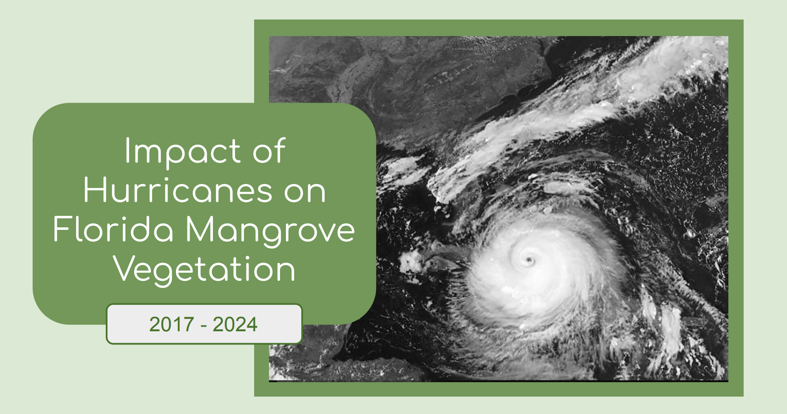
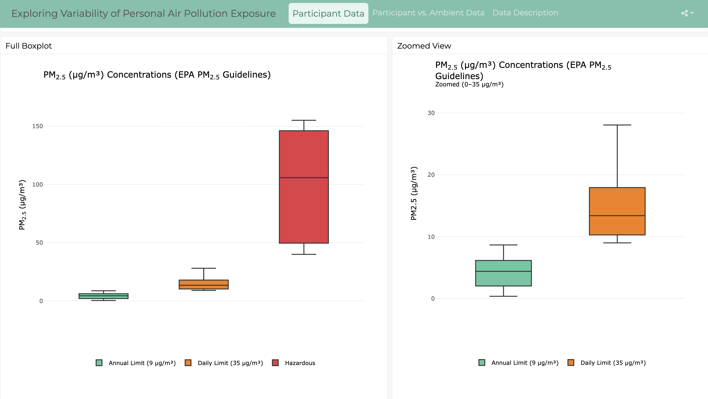

<div class="project-page">
<div class="project-wrapper">
<div class="project-card-page">

```{=html}
<div id="project-gallery">

  <p class="gallery">
  Project Gallery
  </p>

  <p class="project-intro">
  Below are examples of my work related environmental health, GIS, remote sensing, and data visualization.
  Click on a project to view it.
  </p>

<div class="project-gallery">
  <div class="project-card" onclick="showProject('remote')">
    
    <p>Remote Sensing</p>
  </div>

  <div class="project-card" onclick="showProject('dashboard')">
    
    <p>Dashboard</p>
  </div>
</div>

</div>


<div id="remote" class="project-display" style="display:none;">

  <button class="back-button" onclick="backToProjects()">← Back to Projects</button>
  
  <h2>Remote Sensing Project</h2> 
  
  <p>
  This project uses Landsat satellite imagery and NDVI analysis to evaluate how hurricanes impacted mangrove vegetation in Florida from 2017–2024. By comparing vegetation health before and after major storms, the analysis identifies patterns of damage and regrowth. I explored how mangroves are affected by hurricanes and recover over time because mangrove forests play a critical role in coastal resilience by reducing storm surge, limiting erosion, and protecting nearby communities.
  <br><br>
  <p>
    <a href="files/Mangrove_NDVI.pdf" target="_blank">Open Remote Sensing PDF →</a>
  </p>

  <object 
    data="files/Mangrove_NDVI.pdf" 
    type="application/pdf" 
    width="100%" 
    height="800px">
    <p>
      PDF cannot be displayed.
      <a href="files/Mangrove_NDVI.pdf" target="_blank">Open the PDF here</a>.
    </p>
  </object>
    
</div> 

<div id="dashboard" class="project-display" style="display:none;">

  <button class="back-button" onclick="backToProjects()">← Back to Projects</button> 
  
  <h2>Dashboard</h2> 
  
  <p>
    This interactive dashboard presents data from my capstone research project: personal PM₂.₅ exposure concentrations from Metro Atlanta residents and corresponding ambient PM₂.₅ concentrations from the EPA's South DeKalb Ambient Air Monitor. The first page displays boxplots of personal PM₂.₅ concentrations categorized using thresholds from the the EPA and WHO, allowing users to explore how PM₂.₅ exposure concentrations in the study population compare across regulatory and health-based benchmarks. The second page compares individuals’ personal PM₂.₅ concentrations to corresponding ambient levels, highlighting differences between personal exposures and measurements from a fixed-site monitor. Together, these visualizations enable users to examine variability in exposure and better understand how personal PM₂.₅ levels relate to both ambient air quality and established guidelines.
    <br><br>
  </p>
  
  <p>
    <a href="https://emilywilhelm.shinyapps.io/dashboard/" target="_blank">
      Open full dashboard →
    </a>
  </p>
  
  <iframe 
    src="https://emilywilhelm.shinyapps.io/dashboard/#section-participant-data" 
    width="100%" 
    height="800px" 
    style="border: none;">
  </iframe>
  
</div>

```


<script>
function showProject(id) {
  document.getElementById('project-gallery').style.display = 'none';

  document.querySelectorAll('.project-display').forEach(project => {
    project.style.display = 'none';
  });

  document.getElementById(id).style.display = 'block';

  window.scrollTo({
    top: 0,
    behavior: 'smooth'
  });
}

function backToProjects() {
  document.getElementById('project-gallery').style.display = 'block';

  document.querySelectorAll('.project-display').forEach(project => {
    project.style.display = 'none';
  });

  document.getElementById('project-gallery').scrollIntoView({
    behavior: 'smooth'
  });
}
</script>

</div>
</div>
</div>
